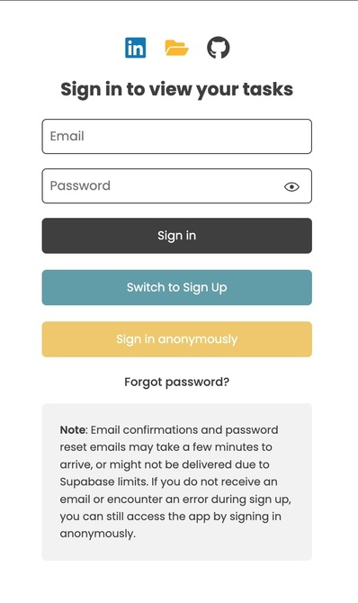

# The simple task manager (Public)

A full-stack task management web application built with React, TypeScript, and Supabase.

▶ **Live Demo:** https://thesimpletaskmanager.netlify.app

---

## Overview
This application allows users to manage their tasks through a clean and intuitive interface. Users can sign up, sign in, or continue anonymously, with tasks securely stored and associated with their account. Stats based on users are also stored and both tasks and stats are updated with realtime updates. Anonymous user’s tasks and stats are automatically deleted once they log out.

The project focuses on authentication flows, client-side state management, and user-friendly task organization features.

---

## Supabase Rate Limits
Due to Supabase’s built-in rate limits, some sign-up and password reset emails may be delayed. As a result, email confirmations can expire before users are able to complete the process, preventing successful sign-ups or password resets. To address this, the app supports anonymous logins, allowing anyone to use the app without creating an account.

---

## Features

### Authentication
- Email/password sign up and sign in
- Anonymous user sessions
- Password update and reset functionality
- Supabase-managed authentication

### Tasks/Stats Management
- Create, read, update, and delete tasks/stats
- Tasks are persisted per user except for anonymous users
- Stats are persisted per user except for anonymous users
- Real-time UI update for tasks and stats 

### Filtering & Sorting
- Sort tasks alphabetically (A–Z)
- Sort by priority
- Filter by date created
- Filter by date last edited
- Reset filters to default
---

## Video Demonstations

### Existing account
[Demo for an existing account](https://www.youtube.com/watch?v=wY8veXTyq_8)

### Anonymous account
[Demo for an anonymous account](https://www.youtube.com/watch?v=wnProlF4TIs)

---

## Tech Stack

- **Frontend:** React, TypeScript, CSS, Motion.dev (Animations)
- **Backend / Services:** Supabase (Authentication & Database)
- **Architecture:** Client-side application

---

## Architecture & Decisions

- The application is built as a client-side React app using Supabase for backend services.
- Authentication and database interactions are handled directly from the frontend using Supabase’s client SDK.
- Environment variables are used to securely manage Supabase credentials.
- Anonymous users can explore the app before creating an account.
- Anonymous users data is deleted once they have logged out.

---

## What I Learned

- Implementing secure authentication flows
- Managing complex UI state with TypeScript
- Designing filtering and sorting logic
- Integrating a backend-as-a-service into a frontend application
- Structuring a project for maintainability

---

## Source Code

The full source code for this project is kept in a **private repository**.

If you’re interested in reviewing the implementation, feel free to contact me.

---

## Author
**Balvinder Singh**

- 🔗 [LinkedIn](https://uk.linkedin.com/in/balvindersingh90)
- 🌐 [Portfolio](https://balvindersinghportfolio.netlify.app/)

